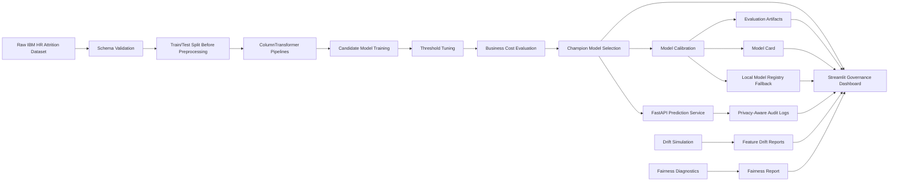
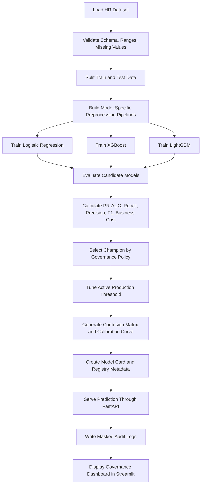

# End-to-End MLOps & Model Governance Platform


---

## Live Application

**Live Streamlit Dashboard:**
https://end-to-end-mlops-model-governance-platform-et3unrnhvmpv6xscxql.streamlit.app/

**GitHub Repository:**
https://github.com/praveenraj9623-sketch/End-to-End-MLOps-Model-Governance-Platform

---

## Project Summary

The **End-to-End MLOps & Model Governance Platform** is a production-style machine learning governance project built around the IBM HR Attrition dataset.

This project goes beyond simple model training. It demonstrates how an ML model can be trained, evaluated, threshold-tuned, governed, explained, monitored, audited, and served through an API.

The platform includes:

* Leakage-safe preprocessing
* Candidate model training
* Business-cost-aware champion selection
* Active production threshold management
* Model calibration
* Confusion matrix and threshold analysis
* Drift simulation and monitoring
* Employee-level explainability
* Fairness and ethics diagnostics
* Privacy-aware audit logging
* FastAPI prediction service
* Streamlit governance dashboard
* Local model registry fallback
* Docker-ready structure
* Automated tests for governance logic

The goal of this project is to show how a machine learning model can be prepared for responsible operational use instead of remaining only as a notebook experiment.

---

## Business Problem

Employee attrition can create major business impact through:

* Hiring replacement cost
* Loss of experienced employees
* Project delays
* Reduced team productivity
* Higher HR and training cost

The business goal is to identify employees who may have a higher risk of attrition so HR teams can review workload, growth, compensation, engagement, and retention signals early.

Because this is an HR-related use case, the model must be handled carefully. It should not be used for automated employment decisions. Instead, this project positions the model as a **decision-support and governance-review system**.

The key questions solved by this project are:

* Which employees have higher attrition risk?
* Which model should be selected as champion?
* Which decision threshold should be used in production?
* How does threshold selection affect business cost?
* Are predictions calibrated?
* Are there drift signals in production-style data?
* Which features influence employee-level predictions?
* Are there fairness gaps across employee groups?
* Are prediction requests auditable and privacy-aware?

---

## Key Features

* End-to-end HR attrition prediction workflow
* Train/test split before preprocessing to prevent data leakage
* Model-specific `ColumnTransformer` pipelines
* Logistic Regression, XGBoost, and LightGBM candidate models
* Champion selection based on business cost, PR-AUC, and recall
* Active production threshold clearly separated from diagnostic thresholds
* Business-cost-aware threshold tuning
* Calibration curve and Brier score tracking
* Active production confusion matrix with standard TN, FP, FN, TP layout
* Model card with intended use, limitations, and not-for-use cases
* Local model registry fallback when MLflow registry is unavailable
* Drift simulation with feature-level drift scoring
* Fairness review across Gender, AgeGroup, Department, JobRole, and MaritalStatus
* Employee-level explanation with model-margin impact values
* Privacy-aware prediction audit trail
* FastAPI endpoints for prediction, health, drift, registry, audit, and retraining
* Streamlit Cloud dashboard deployment
* Docker-ready local setup
* Pytest-based validation for core governance logic

---

## Dashboard Modules

### 1. Executive Summary

The Executive Summary tab provides a high-level governance view of the current champion model.

It shows:

* Champion model
* AUC
* PR-AUC
* Recall
* Precision
* F1 score
* Active business cost
* Active production threshold
* Operational risk distribution
* Governance status
* Dataset row count
* Interview-focused project positioning

This section is designed for recruiters, interviewers, and reviewers who want to quickly understand what the project does and why it is more than a basic ML dashboard.

---

### 2. Model Performance

The Model Performance tab explains how the model behaves under different threshold choices.

It includes:

* Champion model summary
* Active production threshold
* Active business cost
* Threshold policy table
* Candidate model ranking
* Candidate business-cost comparison
* Threshold tradeoff chart
* Active production confusion matrix
* Calibration curve

The dashboard clearly separates the **active production threshold** from candidate/diagnostic thresholds.

The active production threshold is used for:

* API predictions
* Audit logs
* Risk labels
* Active business cost
* Active confusion matrix

---

### 3. Model Registry

The Model Registry tab documents the selected champion and its governance metadata.

It displays:

* Model name
* Registry mode
* Data version
* Generated time
* Training date
* Champion model type
* Model registry table
* Model card metadata
* Governance narrative
* Intended use
* Not-for-use cases
* Limitations
* Decision policy
* Advanced raw model-card JSON

The project also handles local MLflow registry issues safely by falling back to local artifacts instead of crashing the dashboard.

---

### 4. Drift Monitor

The Drift Monitor tab simulates production-style drift scenarios and evaluates feature-level drift.

Supported scenarios include:

* Baseline
* Hiring mix change
* Workload pressure
* Compensation shift

The drift module displays:

* Overall drift score
* Maximum feature drift score
* Features above threshold
* Drift status
* Feature-level drift chart
* Generated drift report paths

Drift status is interpreted as:

| Status          | Meaning                                                           |
| --------------- | ----------------------------------------------------------------- |
| OK              | Drift is near zero                                                |
| Monitor         | Non-zero drift exists but no feature crosses the threshold        |
| Review Required | At least one feature drift score exceeds the configured threshold |

This allows the project to demonstrate model monitoring and retraining governance logic.

---

### 5. Explainability

The Explainability tab provides employee-level prediction interpretation.

For a selected employee, the dashboard shows:

* Attrition probability
* Risk level
* Decision threshold
* Champion model
* Recommended HR action
* Local explanation drivers
* Global feature importance
* Raw employee profile used for scoring

The explanation wording is intentionally non-causal. It avoids saying that a feature “causes” attrition.

Example responsible explanation:

```text
MonthlyRate is associated with a higher model risk score for this employee.
```

The local explanation table uses `model_margin_impact`, which represents model-margin/local contribution scores, not direct probability-point changes.

---

### 6. Fairness & Ethics

The Fairness & Ethics tab provides group-level fairness diagnostics.

It reviews dimensions such as:

* Gender
* AgeGroup
* Department
* JobRole
* MaritalStatus

The dashboard reports:

* Dimensions reviewed
* Groups scored
* Groups needing review
* Sample-size warnings
* High-risk-rate gaps
* Recall gaps
* Group-level fairness table
* Raw fairness report JSON

The governance recommendation is clear:

```text
Use this model only as HR decision support.
Do not use it for automated employment decisions.
Review dimensions marked needs_review before production rollout.
```

---

### 7. Audit Trail

The Audit Trail tab shows privacy-aware prediction audit logs.

It includes:

* Timestamp
* Attrition probability
* Risk level
* Recommended HR action
* Masked request payload
* Response payload
* Audit ID
* Employee hash or employee identifier
* Model name
* Model registry version
* Decision threshold

The dashboard keeps request payloads shortened in the main table while preserving full row details inside an expandable section.

The audit table supports:

* Risk-level filtering
* Date filtering
* Row limit control
* Downloadable audit CSV
* Full filtered audit row inspection

---

## Model Performance

Latest demo champion metrics:

| Metric                      |    Score |
| --------------------------- | -------: |
| AUC                         |    0.753 |
| PR-AUC                      |    0.454 |
| Recall                      |    0.745 |
| Precision                   |    0.289 |
| F1 Score                    |    0.417 |
| Active Business Cost        | $309,000 |
| Active Production Threshold |     0.10 |

This project does not select the model using accuracy alone. Since employee attrition is an imbalanced classification problem, the platform uses threshold tuning and business-cost-aware evaluation to select the operating policy.

---

## Candidate Models

The project trains and compares the following models:

| Model               | Purpose                                |
| ------------------- | -------------------------------------- |
| Logistic Regression | Interpretable baseline model           |
| XGBoost             | Strong tree-based candidate model      |
| LightGBM            | Fast gradient boosting candidate model |

Champion selection policy:

```text
Lowest business cost first,
then PR-AUC,
then recall.
```

This makes the project more realistic because production ML systems often optimize for business impact, not only generic ML metrics.

---

## Important Model Drivers

The model uses HR features such as:

* Age
* Department
* JobRole
* MonthlyIncome
* MonthlyRate
* OverTime
* BusinessTravel
* JobSatisfaction
* WorkLifeBalance
* TotalWorkingYears
* YearsAtCompany
* YearsInCurrentRole
* YearsSinceLastPromotion
* YearsWithCurrManager

The dashboard provides both global and local explanations so reviewers can understand overall model behavior and employee-level prediction drivers.

---

## Architecture



---

## Detailed MLOps Workflow



---

## Technology Stack

| Layer            | Tools                                                             |
| ---------------- | ----------------------------------------------------------------- |
| Programming      | Python 3.11                                                       |
| Data Processing  | Pandas, NumPy                                                     |
| Machine Learning | scikit-learn, Logistic Regression, XGBoost, LightGBM              |
| Preprocessing    | ColumnTransformer, Imputation, One-Hot Encoding, Scaling          |
| Evaluation       | AUC, PR-AUC, Precision, Recall, F1, Confusion Matrix, Brier Score |
| Threshold Tuning | Business-cost-aware threshold selection                           |
| Calibration      | Probability calibration, calibration curve                        |
| Explainability   | Local contribution scores, global feature importance              |
| Governance       | Model card, decision policy, fairness review, audit trail         |
| Drift Monitoring | Feature-level drift scoring, simulated production drift           |
| API              | FastAPI, Uvicorn                                                  |
| Dashboard        | Streamlit, Plotly, Matplotlib                                     |
| Registry         | MLflow with local artifact fallback                               |
| Testing          | Pytest, compile checks                                            |
| Deployment       | Streamlit Cloud, Docker-ready structure                           |
| Version Control  | Git, GitHub                                                       |

---

## Project Structure

```text
End-to-End-MLOps-Model-Governance-Platform/
│
├── app.py
├── README.md
├── requirements.txt
├── Dockerfile
├── docker-compose.yml
├── .gitignore
├── .env.example
├── dvc.yaml
├── dvc.lock
│
├── config/
│   └── configuration files
│
├── data/
│   └── raw/
│       └── hr_attrition.csv
│
├── deliverables/
│   └── project deliverables and outputs
│
├── mlruns/
│   └── local MLflow run artifacts
│
├── models/
│   └── champion model artifacts
│
├── pipelines/
│   └── pipeline definitions
│
├── reports/
│   ├── audit_logs/
│   ├── drift_reports/
│   ├── performance_logs/
│   └── fairness reports
│
├── scripts/
│   └── setup_demo.py
│
├── src/
│   ├── api/
│   │   └── main.py
│   │
│   ├── dashboard/
│   │   └── dashboard helper functions
│   │
│   ├── features/
│   │   └── engineering.py
│   │
│   ├── governance/
│   │   └── fairness.py
│   │
│   ├── models/
│   │   ├── train.py
│   │   ├── evaluate.py
│   │   └── register.py
│   │
│   ├── monitoring/
│   │   └── drift_detection.py
│   │
│   ├── services/
│   │   ├── prediction_service.py
│   │   └── retraining_service.py
│   │
│   ├── storage/
│   │   └── storage utilities
│   │
│   └── utils/
│       └── utility functions
│
└── tests/
    ├── test_api.py
    ├── test_data_validation.py
    ├── test_governance.py
    └── test_model.py
```

---

## Local Setup

Run these commands from Windows Command Prompt inside the project folder.

### 1. Clone the Repository

```cmd
git clone https://github.com/praveenraj9623-sketch/End-to-End-MLOps-Model-Governance-Platform.git
cd End-to-End-MLOps-Model-Governance-Platform
```

### 2. Create Virtual Environment

```cmd
python -m venv .venv
.venv\Scripts\activate.bat
python -m pip install --upgrade pip setuptools wheel
```

### 3. Install Dependencies

```cmd
pip install -r requirements.txt
```

### 4. Build Demo Artifacts

```cmd
python scripts\setup_demo.py
```

This command creates the local model, metrics, model card, fairness, drift, and dashboard artifacts needed for the full demo.

---

## Run the Project Locally

Start FastAPI and Streamlit in two separate terminals.

### Terminal 1: Start FastAPI

```cmd
.venv\Scripts\activate.bat
uvicorn src.api.main:app --host 127.0.0.1 --port 8000
```

FastAPI documentation:

```text
http://localhost:8000/docs
```

### Terminal 2: Start Streamlit Dashboard

```cmd
.venv\Scripts\activate.bat
streamlit run app.py --server.port 8502
```

Streamlit dashboard:

```text
http://localhost:8502
```

---

## FastAPI Endpoints

| Method | Endpoint           | Description                                                    |
| ------ | ------------------ | -------------------------------------------------------------- |
| GET    | `/health`          | Returns model, threshold, drift, and metric health             |
| POST   | `/predict`         | Predicts attrition risk for one employee profile               |
| GET    | `/model-registry`  | Returns MLflow registry rows or local champion fallback        |
| GET    | `/drift-report`    | Returns latest drift score and retraining flag                 |
| GET    | `/audit-log`       | Returns recent privacy-aware prediction audit entries          |
| POST   | `/trigger-retrain` | Triggers Airflow if available, otherwise runs local retraining |

---

## Example Prediction Request

```json
{
  "Age": 41,
  "BusinessTravel": "Travel_Rarely",
  "DailyRate": 1102,
  "Department": "Sales",
  "DistanceFromHome": 1,
  "Education": 2,
  "EducationField": "Life Sciences",
  "EnvironmentSatisfaction": 2,
  "Gender": "Female",
  "HourlyRate": 94,
  "JobInvolvement": 3,
  "JobLevel": 2,
  "JobRole": "Sales Executive",
  "JobSatisfaction": 4,
  "MaritalStatus": "Single",
  "MonthlyIncome": 5993,
  "MonthlyRate": 19479,
  "NumCompaniesWorked": 8,
  "OverTime": "Yes",
  "PercentSalaryHike": 11,
  "PerformanceRating": 3,
  "RelationshipSatisfaction": 1,
  "StockOptionLevel": 0,
  "TotalWorkingYears": 8,
  "TrainingTimesLastYear": 0,
  "WorkLifeBalance": 1,
  "YearsAtCompany": 6,
  "YearsInCurrentRole": 4,
  "YearsSinceLastPromotion": 0,
  "YearsWithCurrManager": 5
}
```

Expected response format:

```json
{
  "attrition_probability": 0.189,
  "risk_level": "Medium",
  "recommended_hr_action": "Schedule a manager check-in and review workload, growth, and compensation signals.",
  "decision_threshold": 0.1,
  "model_name": "xgboost",
  "top_drivers": [
    {
      "feature": "MonthlyRate",
      "model_margin_impact": 285.72,
      "direction": "increases risk",
      "plain_english_meaning": "MonthlyRate value 19479 is associated with a higher model risk score for this employee."
    }
  ]
}
```

---

## Testing

Run the validation commands below:

```cmd
python -m compileall src app.py tests
python -m pytest -q
```

Latest validation result:

```text
25 passed
```

The test suite validates important governance and platform behavior, including:

* API health
* Data validation
* Active threshold usage
* Confusion matrix ordering
* Business-cost logic
* Drift status logic
* Fairness helper logic
* Audit timestamp serialization
* Model registry fallback behavior
* Dashboard helper functions

---

## Docker Setup

The project includes Docker support.

```cmd
docker compose up --build
```

Useful local services:

| Service      | URL                        |
| ------------ | -------------------------- |
| Streamlit    | http://localhost:8502      |
| FastAPI      | http://localhost:8000      |
| FastAPI Docs | http://localhost:8000/docs |
| MLflow       | http://localhost:5000      |

---

## Streamlit Cloud Deployment Note

The deployed Streamlit Cloud app focuses on the governance dashboard experience.

Streamlit Cloud runs the dashboard, but it does not automatically run a separate FastAPI server unless configured separately. For the full production-style local workflow, run both FastAPI and Streamlit locally.

On Streamlit Cloud:

* Dashboard artifacts can be built or loaded from the repository.
* Audit logs may be empty until predictions are generated.
* Full API testing is best performed locally through FastAPI.
* Heavy local files such as virtual environments, cache folders, and temporary artifacts should not be committed to GitHub.

---

## Governance Notes

This project is designed as a portfolio-grade MLOps governance demonstration.

Important responsible-use notes:

* The IBM HR Attrition dataset is small and public.
* Fairness metrics can be unstable for small sample groups.
* Predictions should support human HR review, not replace it.
* The model must not be used for automated employment decisions.
* The model must not be used for termination, promotion, compensation, or disciplinary decisions.
* Real production use would require stronger legal, privacy, security, and fairness validation.

---

## Business Recommendations

Based on this project design, HR teams should use the model output only as a review signal.

Recommended HR actions for higher-risk employees may include:

* Manager check-ins
* Workload review
* Career path discussion
* Compensation review
* Growth opportunity review
* Engagement improvement
* Retention planning

The model should help prioritize review, not make final employment decisions.

---

## Interview Explanation

This project can be explained in interviews as:

```text
I built an end-to-end MLOps and model governance platform for employee attrition prediction.

The goal was not just to train a model, but to demonstrate how a machine learning model can be evaluated, threshold-tuned, governed, monitored, explained, audited, and served through an API.

I used leakage-safe preprocessing by splitting train and test data before transformation. I trained Logistic Regression, XGBoost, and LightGBM candidate models, then selected a champion using business-cost-aware threshold tuning. I also added calibration, active threshold tracking, drift simulation, fairness diagnostics, model-card generation, privacy-aware audit logs, FastAPI endpoints, and a Streamlit dashboard for governance review.

This project shows how machine learning can move from notebook experimentation toward a production-style decision-support workflow with monitoring and responsible AI controls.
```

---

## What Makes This Project Strong

This project demonstrates multiple skills expected in modern Data Scientist, ML Engineer, and MLOps roles:

* Practical machine learning pipeline design
* Leakage-safe preprocessing
* Model comparison and champion selection
* Business-cost-aware evaluation
* Threshold tuning
* Model calibration
* Responsible explainability
* Fairness diagnostics
* Drift monitoring
* Model card documentation
* API-based inference
* Audit logging
* Streamlit dashboard development
* Testing and validation
* Deployment awareness

It shows that the project is not only about building a model, but also about managing the model after training.

---

## Future Improvements

Possible future enhancements:

* Deploy FastAPI as a separate hosted backend
* Connect Streamlit Cloud to the hosted FastAPI endpoint
* Add GitHub Actions CI/CD pipeline
* Add scheduled drift checks
* Add automated retraining workflow
* Add DVC-based dataset versioning
* Add persistent database-backed audit logging
* Add authentication for dashboard access
* Add role-based access for HR, data science, and governance users
* Add alerting for drift and fairness review triggers
* Add downloadable governance reports
* Add production monitoring with Prometheus/Grafana

---

## Disclaimer

This is a portfolio project created for learning, demonstration, and interview purposes.

It should be presented as project-based data science and MLOps experience, not as company employment experience.

The model should not be used for real HR employment decisions without proper production validation, legal review, privacy review, fairness review, and human oversight.

---

## Author

**Praveen Raj A**
Data Scientist / Machine Learning / MLOps Portfolio

GitHub: [praveenraj9623-sketch](https://github.com/praveenraj9623-sketch)
Live App: [End-to-End MLOps & Model Governance Platform](https://end-to-end-mlops-model-governance-platform-et3unrnhvmpv6xscxql.streamlit.app/)
